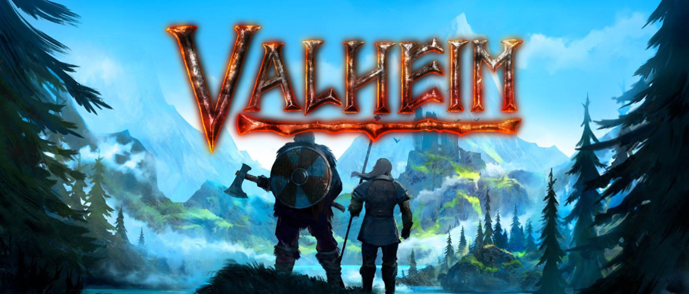
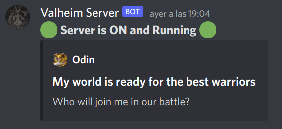
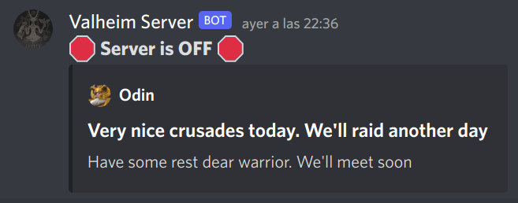
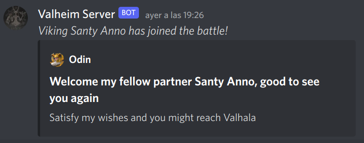
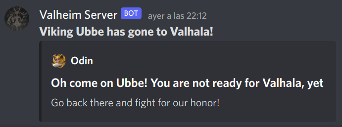

<a name="readme-top"></a>

<!-- PROJECT SHIELDS -->
<!--
*** I'm using markdown "reference style" links for readability.
*** Reference links are enclosed in brackets [ ] instead of parentheses ( ).
*** See the bottom of this document for the declaration of the reference variables
*** for contributors-url, forks-url, etc. This is an optional, concise syntax you may use.
*** https://www.markdownguide.org/basic-syntax/#reference-style-links
-->
[![Contributors][contributors-shield]][contributors-url]
[![Forks][forks-shield]][forks-url]
[![Stargazers][stars-shield]][stars-url]
[![Issues][issues-shield]][issues-url]
[![MIT License][license-shield]][license-url]
[![LinkedIn][linkedin-shield]][linkedin-url]


<!-- PROJECT LOGO -->
<br />
<p align="center">
  <a href="https://github.com/jaumebecks/valheim-server-notifier">
    
  </a>

  <h3 align="center">Valheim Server Notifier <i>(aka Odin)</i></h3>

  <p align="center">
    Using Python
    <br />
    <a href="https://github.com/jaumebecks/valheim-server-notifier/issues">Report Bug</a>
    ·
    <a href="https://github.com/jaumebecks/valheim-server-notifier/issues">Request Feature</a>
  </p>
</p>

<!-- TABLE OF CONTENTS -->
<details open="open">
  <summary><h2 style="display: inline-block">Table of Contents</h2></summary>
  <ol>
    <li>
      <a href="#about-the-project">About The Project</a>
      <ul>
        <li><a href="#built-with">Built With</a></li>
      </ul>
    </li>
    <li>
      <a href="#getting-started">Getting Started</a>
      <ul>
        <li><a href="#prerequisites">Prerequisites</a></li>
        <li><a href="#installation">Installation</a></li>
      </ul>
    </li>
    <li><a href="#usage">Usage</a></li>
    <li><a href="#roadmap">Roadmap</a></li>
    <li><a href="#contributing">Contributing</a></li>
    <li><a href="#contact">Contact</a></li>
    <li><a href="#acknowledgements">Acknowledgements</a></li>
  </ol>
</details>

<!-- ABOUT THE PROJECT -->

## About The Project

This project's purpose is to increase the experience of playing Valheim in a
dedicated server with some friends, by notifying in Discord some Valheim Server
log events, such as `ServerOn`, `ServerOff`, `PlayerJoined`, `PlayerDead`, etc.

Essentially, it continuously reads the server logs and reacts to some events
that match certain patterns. Whenever a match appear, it generates a template for
sending alerts to a Discord server. It has the capability to adapt to rotating log files,
too

### Built With

- [Python3](https://www.python.org/)

<!-- GETTING STARTED -->

## Getting Started

### Prerequisites

You'll need to install the following in order to be able to run the application

- [Python3](https://www.python.org/downloads/release/python-3100/)

And to configure some envvars in your Valheim Server

```sh
VALHEIM_LOG_PATH # Path to current server console log
DISCORD_WEBHOOK_URL # Discord Webhook URL
```

#### How to find server console log path

It depends on how you configured your Valheim Server. For example, for LinuxGSM
installations, it's located in `/home/<your-username>/log/console/vhserver-console.log`
by default

#### How to create a Webhook in Discord

It's really simple! Please refer to their [Official Documentation](https://support.discord.com/hc/en-us/articles/228383668-Intro-to-Webhooks)
for better guidelines

### Installation
To get a local copy up and running follow these simple steps.

First, we'll get the code

#### Get the code

In your Valheim Server

1. Clone the repo

  ```sh
  git clone https://github.com/jaumebecks/valheim-server-notifier.git
  ```

2. Go into project root

  ```sh
  cd valheim-server-notifier
  ```

3. Update .env file

  ```sh
  cp .env.dist .env
  ```

4. Open `.env` file and fill it with proper values


#### Run script automatically on server start

We're going to create a systemctl service that will be running always in our
server. To do so, first we need to create a file under `/etc/systemd/system/`
folder

1. Create a file with your preffered name

  ```sh
  sudo touch /etc/systemd/system/valheim-odin.service
  ```

2. Edit the file with your preffered editor and put

  ```sh
  [Unit]
  Description=Valheim Server Notifier
  Wants=network-online.target
  After=syslog.target network.target nss-lookup.target network-online.target

  [Service]
  Type=simple
  Restart=on-failure
  RestartSec=5
  StartLimitInterval=1s
  User=<your-username>
  Group=<your-groupname>
  ExecStart=/usr/bin/python3 /home/<your-username>/valheim-server-notifier/odin/main.py
  EnvironmentFile=/home/<your-username>/valheim-server-notifier/.env
  ExecReload=/bin/kill -s HUP $MAINPID
  ExecStop=/bin/kill -s INT $MAINPID
  LimitNOFILE=100000

  [Install]
  WantedBy=multi-user.target
  ```

> Remember to update the variables with proper ones for your own setup

3. Enable the service in your server

  ```sh
  systemctl daemon-reload
  systemctl start valheim-odin.service
  systemctl enable valheim-odin.service
  ```

And that's it! Now the python script will be reading from Valheim server logs, waiting
to post any event into Discord :D

## Usage

To run the script in local

  ```sh
  VALHEIM_LOG_PATH=<fill-with-your-log-file> DISCORD_WEBHOOK_URL=<fill-with-your-webhook-url> python3 odin/main.py
  ```

> Remember to add some envvars first

To check the logs for systemctl service

  ```sh
  journalctl -u valheim-odin.service
  ```

### Examples

<table>
  <tr>
    <td><b>Server On</b></td>
    <td></td>
  </tr>
  <tr>
    <td><b>Server Off</b></td>
    <td></td>
  </tr>
  <tr>
    <td><b>Player Joined</b></td>
    <td></td>
  </tr>
  <tr>
    <td><b>Player Died</b></td>
    <td></td>
  </tr>
</table>


<!-- ROADMAP -->

## Roadmap

See the [open issues](https://github.com/jaumebecks/valheim-server-notifier/issues) for a list of proposed features (and known issues).

<!-- CONTRIBUTING -->

## Contributing

Contributions are what make the open source community such an amazing place to be learn,
inspire, and create. Any contributions you make are **greatly appreciated**.

1. Fork the Project
2. Create your Feature Branch (`git checkout -b feature/AmazingFeature`)
3. Commit your Changes (`git commit -m 'Add some AmazingFeature'`)
4. Push to the Branch (`git push origin feature/AmazingFeature`)
5. Open a Pull Request

<!-- CONTACT -->

## Contact

Jaume Jiménez - [@jaumebecks](https://twitter.com/jaumebecks)

Project Link: [https://github.com/jaumebecks/valheim-server-notifier](https://github.com/jaumebecks/valheim-server-notifier)

[![LinkedIn][linkedin-shield]][linkedin-url]

<!-- ACKNOWLEDGEMENTS -->

## Acknowledgements

- [@joselgomezs](https://github.com/joselgomezs) As an inspiration for the solution
- [Reddit user `somekindofsorcery`](https://www.reddit.com/r/valheim/comments/n7vv9b/do_server_logs_have_things_like_deaths/)


<!-- MARKDOWN LINKS & IMAGES -->
<!-- https://www.markdownguide.org/basic-syntax/#reference-style-links -->
[contributors-shield]: https://img.shields.io/github/contributors/jaumebecks/valheim-server-notifier.svg?style=for-the-badge
[contributors-url]: https://github.com/jaumebecks/valheim-server-notifier/graphs/contributors
[forks-shield]: https://img.shields.io/github/forks/jaumebecks/valheim-server-notifier?style=for-the-badge
[forks-url]: https://github.com/jaumebecks/valheim-server-notifier/network/members
[stars-shield]: https://img.shields.io/github/stars/jaumebecks/valheim-server-notifier?style=for-the-badge
[stars-url]: https://github.com/jaumebecks/valheim-server-notifier/stargazers
[issues-shield]: https://img.shields.io/github/issues/jaumebecks/valheim-server-notifier?style=for-the-badge
[issues-url]: https://github.com/jaumebecks/valheim-server-notifier/issues
[license-shield]: https://img.shields.io/github/license/jaumebecks/valheim-server-notifier?style=for-the-badge
[license-url]: https://github.com/jaumebecks/valheim-server-notifier/blob/master/LICENSE.txt
[product-screenshot]: images/screenshot.png
[linkedin-shield]: https://img.shields.io/badge/-LinkedIn-black.svg?style=for-the-badge&logo=linkedin&colorB=555
[linkedin-url]: https://linkedin.com/in/jaume-jimenez-forteza
